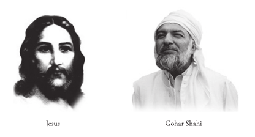

## The Return of Jesus: Jesus Christ meets Gohar Shahi in America

In an interview in London on July 28, 1997, His Divine
Eminence Gohar Shahi made the following statement.

On 29th May 1997, I was at the El Monte Lodge in Taos, New Mexico.
During the second half of the night, I felt the presence of a man in my
room. There was not enough light, so at first I thought it was one of my
followers.

I asked him, ‘Why have you come?’ the man replied, ‘I have come to see
you.’ I turned on the light and I saw a handsome young man standing
before me, whom I did not know. Seeing him, I felt immense energy and
spiritual ecstasy in my soul and spiritual entities, a similar spiritual ecstasy
that I would feel and experience in the gathering of the ‘Higher Realms’.

I learnt that he could speak many languages. The young man told me, ‘I
am Jesus (Son of Mary); I am in America, presently.’ I asked him, ‘Where
do you live?’ he replied, ‘I neither had a home in the past nor now.’

When His Divine Eminence Gohar Shahi was requested for further details
of the meeting, His Divine Eminence replied, ‘What Jesus and I have
discussed is a secret but I shall reveal it at an appropriate time in future.’
His Divine Eminence Gohar Shahi states, ‘A few days later, I visited
Tucson (Arizona), where somebody showed me a photograph and said, “It
was Jesus.” I instantly recognised the man in the photograph, as he was
the same man who appeared in my room at the El Monte Lodge. I asked
the owner of the photograph about its origin. He told me, “Some people
took photographs of some sacred places, and surprisingly, this photograph
of (Jesus) emerged from amongst the prints when the film was processed.
This man was neither seen nor photographed.” I took the photograph of
this young man (Jesus) and tried to match it with the one of many images
on the Moon. I realised that the image on the photograph matched one of
the images on the Moon. I confirm and verify that this is the true Image
of Jesus.’

A magazine in America recently published an article quoting Bible experts
regarding the ‘Return of Jesus’ and events leading up to the end of the world.
Much of the information published, particularly secret Bible Prophecies
released by the Vatican in Rome, and the opinions of experts, coincide with
this statement made by His Divine Eminence Gohar Shahi.