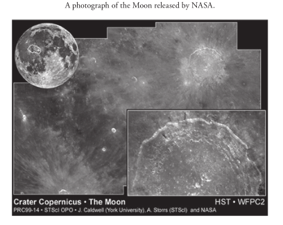
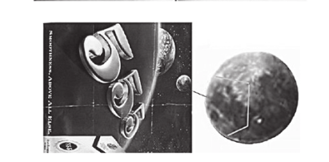

## Miraculous Images of His Divine Eminence Ra Gohar Shahi

### Moon 

In the 1991 Summer-Fall
edition of the Phoenix
Official Visitor’s Guide,
the image of His Divine
Eminence Gohar Shahi on
the Moon is clearly visible.
Image courtesy of: Boot
Traverse, Photographer.

A close-up of the image of
the Moon from the Phoenix
Official Visitor’s Guide cover.
It has been blurred so the
face of His Divine Eminence
is further prominent.
According to this letter from
the photographer, 

‘The
enlargement of the moon,
which I photographed over
downtown Phoenix in
February 1990, does have
the likeness of a man in
profile when viewed rotated
90 degrees.’

His Divine Eminence Ra Gohar Shahi

On the left: an unaltered image of the Moon. On the right, the face
of His Divine Eminence has been digitally superimposed for ease of
comparison.

The face of His Divine Eminence alongside an enlarged image of the
Moon.

The Moon in different phases, with the image of His Divine Eminence
visible throughout. His Divine Eminence’s face has been indicated.
__Source: Collin’s Skywatching: The Ultimate Guide to the Universe (English language
edition, 1995) by David H Levy; Page 239.__

__Various poses of the true images of His Divine Eminence Gohar
Shahi__

A photograph of the Moon released by NASA.

__Source: News Release: Hubble Shots of the Moon (April 16, 1999), by John Coldwall
and Alex Stars in association with NASA.
http://hubblesite.org/newscenter/archive/releases/1999/14__

“More details about the Moon are on the next page.”

God said, ‘We will show you our signs in the near future, in the universe
and within yourselves until you believe this is the truth.’

‘Look for his signs in the skies, in the land, and in space; the signs belong
to the one who will appear from the east.’—Allama Iqbal

The image of the moon has been rotated in an anti-clockwise direction.
By doing this, the images on the Moon become clearly visible.

The comparisons between various pictures of His Divine Eminence
Gohar Shahi and images of the Moon show that the face on the Moon
is indeed of His Divine Eminence.

The images were taken from the book Pictorial Astronomy

The Moon and a sketch beside it depicting the likeness of a woman.

When it was revealed in the United States that the image on the Moon is
of a person of Asian origin and whose features suggest that He is a Muslim;
subsequently, the image was rotated clockwise. The photograph above (1)
is an original photograph of the Moon. The photograph (2) relates to the
Moon also. This has been modified: A part of the face and beard have
been altered to show hair of the head while deleting the face which is
clean shaven. Photograph (3) above depicts the attempt Dinsmore made
to portray it as a woman’s so that viewers would be misled into believing
that it is the image of the Virgin Mary. The chin has been shortened in the
photograph, the neck profile made smooth and the eyes elongated.

**A distortion of the signs of God is not a good omen as these images
will soon become apparent throughout the whole world.**

**Images of the Moon published in various articles, and printed by
many companies.**

Whether you are in the east or the west, try taking a photograph of
the Moon with your personal camera, from any angle, and you will see
these images.

Another example of His Divine Eminence Gohar Shahi’s face on an
image of the Moon printed by a third party.
__Source: Collin’s Skywatching: The Ultimate Guide to the Universe (Page 235, 1995
English Edition) by David Levy.__

### Sun

The given photograph of the Sun is released by NASA.

Photograph of the Sun.

__Source: Nasa’s SOHO Solar Observatory; December 29th, 1999.__

The above image of the Sun has been rotated clockwise to reveal various
images of His Divine Eminence Gohar Shahi that are present in the
Sun.

**‘Verily, the Moon and the Sun show signs of your grandeur.
Nevertheless, the evidence of your truthfulness is in you dwelling in
my heart.’—Younus AlGohar**

A NASA photograph of the Sun on which the matching image of Gohar
Shahi is seen very clearly.

### Space

This article discusses the findings of NASA in relation to a face in space
estimated by NASA scientists to be the size of 150 suns. The article talks
about how strange it is that the face in space had never been discovered
before, given its size.
According to Astronomer Isaac Hawkins of Atlanta, GA, ‘This is plainly
the image of a man’s face far, far off in the universe.’ The article explains
how this miraculous image was clearly distinguishable one moment
and then astonished observers by somehow retreating from view the
next moment. The article speculates that the image is something on a
‘[technologically] advanced level.’ This discovery was also the first due
to which NASA consulted with theologians, as ‘The idea that this could
be the face of God [had] crossed [their] minds.’

__Source: ‘NASA Finds Massive Face in Space’ by Whitney Asque, Weekly World
News (May 7th, 1996).__

A comparison between the image of His Divine Eminence Gohar Shahi
and the face that appeared in space.

__Source: Muskurahat Monthly Magazine (Lahore).__

> This image of His Divine Eminence Gohar Shahi is in fact a spiritual
entity known as Tifl-e-Noori. Only special Saints have been known to
possess this. References are found in various books by Sufis.

### Black Stone

***A human face is discovered on the black stone (Hajar Al Aswad) in
Mecca, Saudi Arabia.***

> According to this article, Sheikh Hamad bin Abdallah stated in relation
to the appearance of a human face in the Holy Black Stone, ‘Spiritualists
in Mecca say that this is the face of the awaited Imam Mehdi.’

*Source: A Human Face Discovered on the Holy Black Stone in Mecca, Saudi Arabia;
Staff Reporter, the Daily Parcham (Karachi, Pakistan), May 26, 1998.*

According to this report, ‘It is said amongst spiritual circles that in
addition to his facial image becoming prominent on the Sun and Moon,
the face on the Holy Black Stone is that of Riaz Ahmed Gohar Shahi
of Pakistan.’

Above: a clipping of the monthly Great God Magazine’s article about
the image on the Holy Black Stone. The article speculates whether the
face is of His Divine Eminence Gohar Shahi, and shows a comparison
between an image of His Divine Eminence and an image of the Holy
Black Stone, which has been digitally contrasted to highlight the face
within it.

The image is so clear that no one can deny its existence. Many are saying
that the image is the face of the awaited Imam Mehdi AS. An excerpt
from this newspaper article:

> ‘According to a facsimile received from Saudi Arabia, Sheikh Hammad bin
Abdallah has issued a press release from Mecca. It states that prior to the
pilgrimage, clear signs of a human image were visible on the Holy Black
Stone. The image is inverted; for this reason is not visible at first sight. But
it can be clearly seen once it has been pointed out. Sheikh Hammad bin
Abdllah has said that there could be two reasons for this image; either it
has appeared naturally or perhaps it is manmade. As the Black Stone is
heavily guarded by officials and given that there are masses of pilgrims
around it at all times, it is unlikely that any person would be courageous
enough to make and place an image on the Black Stone. The question
arises: if the image has always been on the Black Stone, then why has no
one noticed it? The image is so clear it cannot be denied or rejected.’

**Source: Muhasib News, Karachi (June 16-30,1998)**

This is the unaltered cover of a textbook on religion published by the
Government of Punjab. It is inverted here to show the human image
that is clearly visible within the Holy Black Stone.

*Source: Deeniyat (Year 3) by the Pakistani Text Book Depot (Lahore).*

Images of the Holy Black Stone, in which a human form has naturally
appeared and is visible when viewed upside down. It is highlighted on
the far right for easy recognition.

*Source: Mirza Library, Mecca (Saudi Arabia).*

The images on the far left and the far right are of the Holy Black Stone.
Their contrast has been brought up as to emphasise the human figure
within.

*Source: Mirza Library, Mecca (Saudi Arabia).*

The middle image is of His Divine Eminence Gohar Shahi.

These images taken from Mirza Library and the Pakistani textbook are
upright. When upright, another image is seen in the Holy Black Stone.
It has been isolated on the far left.

The image is marked and highlighted for easy recognition here. It is also
of His Divine Eminence Gohar Shahi.

At the age of 25, Jussa-e-Gohar Shahi (the sub-spirit of Gohar Shahi)
was coronated as the Commander of the Esoteric Cavalry.

### Nebula

**This photograph has recently appeared on a planetary nebula a Sun-
like star, it was released by NASA**

The image of the Eskimo Nebula taken by NASA has been rotated in
an anti-clockwise direction to reveal a face with something written on
it. It is indicated, and compared to an image of His Divine Eminence
Gohar Shahi.

The original photograph of NGC 2392 has been rotated to expose more
images of His Divine Eminence Gohar Shahi.

Many people say, ‘These images are simply imagination.’ Imagination
is confined to one who imagines; imagination cannot be captured on
camera. Others declare it to be telepathy or mesmerism—however,
places of worship, the land and the sky cannot be subject to telepathy
or magic; if this is the case then where is the truth? Some others say that
the United States has received money to digitally place the images in
these celestial bodies. Is Gohar Shahi wealthier than the USA? If it were
possible to place these images, then the United States would have used
the image of the Pope as to benefit its religion and country.

### Mars

Two faces in one picture when rotated at 180 degrees.

Images featured in the article are from The Martian Enigmas: A Closer
Look, By Mark J. Carlotto (1992).

*Source of image: The Martian Enigmas: A Closer Look, By Mark J. Carlotto (1992).*

Professor Mark J. of Boston University having researched and verified
these photographs published them in his book.

NASA has taken these photographs from different angles and different
views. Visit the following website. http://science.nasa.gov/science-news/
science-at-nasa/2001/ast24may_1/

*Source of image 3: http://www.tlig.org/pg/pgjesus.html*

> When this picture is straight, the image of Jesus Christ is visible, when
turned upside down, the image of His Divine Eminence Gohar Shahi
is visible.

### Science and Technology

‘In 1998, the Mars Global Surveyor took pictures of Mars. On the surface
of Mars, there was a rock found which resembled the face of a human
being. It was one mile long and 2000 feet high. It was made by beings
that were similar to us and had lived there in the past. An astronomer, Dr
Frania, says, “This is the proof of the one we have been awaiting for a long
time.”‘—A translated excerpt in regards to the Face on Mars from Science
and Technology, The Jang Sunday Magazine, (Pakistan), published on
March 18, 2001.

### People ask, ‘Why do you publicise these images?’

We reply, ‘These images are signs from God. They have purpose and indicate
to the seekers of the truth that they may approach God through this man
who is God’s existing representative.’ It is the signal for both the sinners
and those who do not believe in any religion, that they too should adopt
the way of guidance and find salvation through the Divine Knowledge
that God has bestowed upon him. God has made this knowledge simple
and easy in accordance with your nature.

Jesus Christ met His Divine Eminence Gohar Shahi in New Mexico,
during the year of 1997.

- The news along with the above photographs was published in the
August 15, 1997 edition of the weekly Payam (Manchester, UK).
- Sada-e-Serfrosh (Pakistan), a fortnightly magazine, published the
same news in September 1997.
- The BBC broadcasted this news on GMR Radio (UK) in October 1997.

Research into this matter is encouraged.

*Source of image: The Martian Enigmas: A Closer Look, (Page 27) By Mark J.
Carlotto (1992).* 

**In the above picture, His Divine Eminence Gohar Shahi and Jesus
Christ are facing each other.**

This news clipping appeared in the newspaper ‘Pakistan Post New York’,
dated 14-06-2001.

*It was also published in the Nawa-i-Waqt UK on 29-06-2001.*

**In addition to Mars, images of His Divine Eminence Gohar Shahi have
appeared on Nebula Star, Moon and various other places.**

Visit our website www.goharshahi.gs

People often inquire whether it is the truth. If it is not then we are
blatant liars. (Curse upon liars).