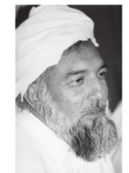
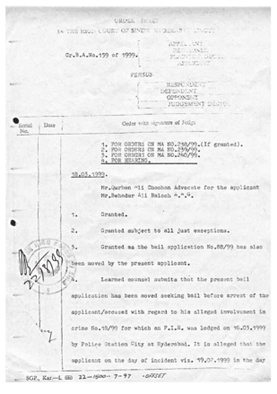
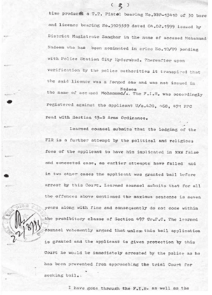
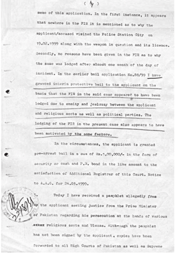
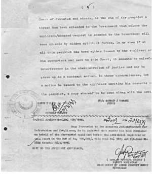

import { Camera } from 'lucide-react';

# His Divine Eminence Ra Gohar Shahi

This is that Gohar Shahi, who in particular, secluded Himself for three
years in the mountains of Sehwan and in the
Laal Bagh, in austerity and spiritual self-
discipline, all for the sake of God’s love. His
Divine Eminence initiated thousands of people
onto the mystical path through purification and
heart-invocation and motivated a multitude of
people to obtain Divine Love. People of all
religions invited His Divine Eminence for
spiritual lectures to Mosques, Hindu Temples,
Churches, and Sikh Temples, and acquired
heart-invocation by His Divine Eminence.

Countless men and women repented and inclined
towards God inspired by His Divine Eminence’s
teachings. His spiritual grace restored health in countless individuals who
suffered from incurable ailments.

Then, God manifested the face of His Divine Eminence Gohar Shahi on
the Moon. Later, His Divine Eminence’s image became visible in the Holy
Black Stone also. He became famous throughout the world.

Radical clerics and the Muslims who begrudge the Sufis did not like
His Divine Eminence Ra Gohar Shahi. They tampered with the text
of His Divine Eminence’s books, trying to find a pretext to have issued
fatwa’s of death and kufr (rejection). His residence in Manchester, United
Kingdom, was bombed. A hand grenade was aimed at Him whilst His Divine Eminence addressed disciples in Kotri, Pakistan. A huge amount
of money was declared on His head.

His Divine Eminence was trapped in five different false cases in Pakistan.
The Government of Sindh became a party against His Divine Eminence
because of Nawaz Sharif’s enmity towards His Divine Eminence. Two
cases of alleged murder, one case that of possession of illegal arms, and
another case of illegal possession of land were instigated against His Divine
Eminence. In the USA, His Divine Eminence was trapped in a false case
of felony and illegal detention of a woman. Yellow journalism left no
stone unturned in defaming and dishonouring Him. Eventually, after the
hearing and thorough investigation, all the cases were proved false and
the court acquitted His Divine Eminence as innocent. God protected His
Friend against all odds.

**Please find attached the Sindh High Court report of cases against His
Divine Eminence Ra Gohar Shahi.**

