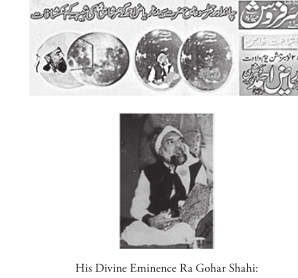
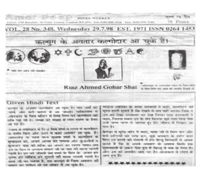

## An Insight into the Manifestation of Human Images in the Moon, Mars, and various other planets

Jesus Christ is symbolic to divinity, a towering personality, and enjoys a
close relationship to God, hence, needs no formal introduction at all. His
fame stands out. Images of Jesus Christ have appeared on many planets
and locations. Many individuals of the present era are fortunate enough
to have met Jesus Christ in person.

His Divine Eminence Ra Gohar Shahi is also present on earth. His Divine
Eminence is always on the move, and does not stay in one specific home.
The images of His Divine Eminence are prominent on various planets
including Mars. His Divine Eminence has penned some remarkable books
on spirituality, which are available at www.goharshahi.com. His Divine
Eminence Ra Gohar Shahi comes from Pakistan, and advocates spiritual
sciences and Sufism.

His Divine Eminence Ra Gohar Shahi says, ‘I am neither a Prophet nor an
apostle; nevertheless, I have the full support of Mohammad (The Founder
of Islam), Jesus Christ (The Founder of Christianity) and many other
Prophets.’

His Divine Eminence says, ‘A non-religious individual who possesses God’s
love in his heart is better than a religious one who doesn’t love God.’

The Muslim clerics ask His Divine Eminence to say that the Muslims are
the best among all. On contrary to this; His Divine Eminence says, ‘The 
best among all is one who possesses God’s love, no matter what religion
he belongs to.’

The Muslim clerics say, ‘The right of entry to the paradise is subject to
declaration of the Muslim faith.

One Muslim faction says, ‘Spirituality (knowledge that deals in purification
and enlightenment of the heart) and Sufism is all unholy.’ On contrary to
this, His Divine Eminence says, ‘Without the purification of the heart, all
worship is unholy, insincere and a total waste.’

According to the Muslim faith, a soul takes one birth only. According to
His Divine Eminence Ra Gohar Shahi’s book, ‘The Religion of God’, only
the celestial soul takes a single birth in this world, whereas the terrestrial
souls may take several births in different bodies. Because of such beliefs
of His Divine Eminence, many Muslims have turned hostile towards His
Divine Eminence. It is because of such beliefs of His Divine Eminence
Gohar Shahi that the Pakistani Government has banned His book. Bombs
were thrown at Him on several occasions. Many Muslim organisations
have announced rewards on his head. The Pakistani Government has
trapped His Divine Eminence in false cases of blasphemy against Islam.

His Divine Eminence Ra Gohar Shahi does not propagate any religion but
advocates Divine Love, and renders practical teachings that of bringing
God and his love in the heart. His Divine Eminence says, ‘God himself
will guide you once you are connected with God.’ Many of the disciples
of His Divine Eminence can see God’s name written on their hearts while
they meditate. His Divine Eminence says, ‘God’s name in any language
is worthy of respect, and spiritual grace can be obtained from its practice.’
People of all religions love Him. His Divine Eminence has delivered
lectures on spirituality in mosques, Hindu temples, Sikh temples, and
Churches in the UK, the USA, Europe, Africa, Middle East and Asia.
Through His spiritual power, His Divine Eminence has healed numerous
people who suffered from incurable ailments.

**Dare not reject the Divine Signs on account of any religious, racial or
national bias or prejudice.**

> __***Beware! God has anointed His Divine
Eminence to reform, unify and connect
Humanity with God. Look for Him, and
personally research in His doctrine and
personality.***__

Any organisation or individual wishing to obtain information about His
Divine Eminence Gohar Shahi may contact us. We are committed to
provide all necessary information justly.

After politicians used their influence, NASA at last acknowledged the
existence of human images on Mars. There are images on various other
planets, which NASA has yet concealed. NASA is still reluctant to verify
the identity of whom the images resemble.

Disturbing Controversies: The Cydonia Region of Mars
http://creation-science-prophecy.com/links.htm

Contact:
+44 (0) 79 0000 2676
+44 (0)77 2473 4130
younus380@yahoo.co.uk
amjadgohar75@yahoo.com

In an August 8, 2001 letter to Mr Sunny Peter of the UK, NASA stated,
‘On July 25, 1976, as NASA’s Viking 1 spacecraft was circling the planet
Mars photographing the surface for possible landing sites for its sister ship
Viking 2, the spacecraft took a picture of a feature in the Cydonia region
of the planet that resembled the shadowy likeness of a human face.’

**A headline from a Pakistani Newspaper about His Divine Eminence
Gohar Shahi.**

‘I appeal to the Pakistani Government and its officials to carry out a
thorough investigation into the existence of my images on the Moon
and Hajar al Aswad (Holy Black Stone). If these images prove to be
truthful, the government should support me so that the teachings of
Divine Love may be propagated throughout the world so that it may
relatively become easy to unify the hearts of humanity and so people
may guide themselves in their desired direction.’

‘Should the above given details be proved wrong, the government
deserves the right to punish and persecute.’

Undersigned, 
Ra Gohar Shahi

Above is a clipping from an article by the Daily Mehran about an image
of His Divine Eminence Gohar Shahi on the sacred stone in the Shiv
Temple in Umar Kot (Sindh, Pakistan).

*‘Countless people are coming with great affection to see the images.’—the
Daily Mehran (Hyderabad, Pakistan)*

The popular Sindhi newspaper, the Daily Mehran, published the news
of the discovery of an image of His Divine Eminence Gohar Shahi on
the sacred stone within the Shiv Temple near Umar Kot in its June 6,
1998 edition. Hindus are gathering with great affection and interest to
see the image. A pamphlet was distributed in regards to this matter and
subsequently the stone became a focal point for the masses. The Hindu
Community is joyful and is celebrating the appearance of the image of
His Divine Eminence Gohar Shahi.

An advertisement introducing His Divine Eminence Gohar Shahi, given
by the local Hindu Community in the weekly July 29, 1998 edition of
the Des Pardes, published in London (UK).

This article discusses how many Hindus saw His Divine Eminence
Gohar Shahi healing them in their dreams. Many of the blind had their
sight restored, and many of the mute were able to speak again.

> A Divine Phenomenon: On the right hand of His Divine Eminence
Ra Gohar Shahi, ‘Mohammad’ is visible. On the left hand’s fingers, the
word ‘Allah’ is visible.

*Important Note: Some people wonder why ‘Allah’ is inscribed on the
left hand’s fingers (they regard it as disrespectful for the name ‘Allah’
to appear on the left hand subject to its usage for cleaning oneself). His
Divine Eminence Gohar Shahi explains, ‘I could be rightly accused of
such an act, had I created the fingers myself or somehow managed to
inscribe ‘Allah’ on them. For the best, does only Allah know whether it
is a coincidence or a miracle of Allah.’*