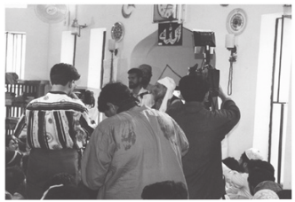
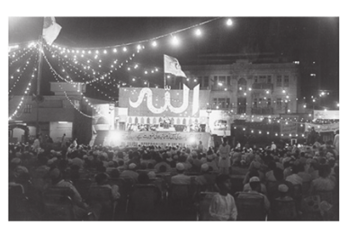

## Programs

His Divine Eminence Gohar Shahi began rendering his teachings to the
masses in 1980. His message of divine love was acclaimed publically.
Peoples of all religions began to love and revere His Divine Eminence
Gohar Shahi. In order to acquire Dhikr Qalb and to benefit from His
lectures on spirituality, they invited His Divine Eminence to their respective
worship places.

This is an extraordinary miracle, unprecedented in history that His Divine
Eminence Gohar Shahi lectured from the pulpit of every religious place.
There are countless miracles attributed to His Divine Eminence Gohar
Shahi, and some selected miracles are presented here for your perusal and
satisfaction:

The Christian Community in New York invited His Divine Eminence
Gohar Shahi for a lecture on Spirituality in the New Yorker hotel on
October 2, 1999.

His Divine Eminence Gohar Shahi addressing a Christian audience in
the Central Church of Tucson, Arizona (USA).

A photograph of a spiritual gathering in Lahore, Pakistan, on April
11, 1996. The majority of the audience consisted of Hanafi and Sha’afi
Muslims.

His Divine Eminence Gohar Shahi addressing the Unitarian Universal
Fellowship in Prescott, Arizona (USA), in July 1997.

His Divine Eminence Gohar Shahi delivering a lecture at a Sai Baba
Temple in Durban, South Africa. The gathering was attended by Sai
Baba Devotees and Ignocolists.

His Divine Eminence Gohar Shahi speaking at the Nur-e-Iman
Mosque in Nazimabad, Karachi (Pakistan). Muslims from the Shia
sect attended.

His Divine Eminence Gohar Shahi rendering Spiritual Grace to a Sikh
audience at the Guru Nanak Gurduwara in Phoenix, Arizona (USA).

**A news clipping from an interview with His Divine Eminence Gohar
Shahi in the Punjabi Gurmukhi language.**

On October 17, 1999 the Sikh Society of San Francisco (USA) invited
His Divine Eminence Gohar Shahi to speak on the subject of Divine
Love. The Sikh Society published His Divine Eminence’s speech for the
benefit of the local Sikh community. The published piece gave details
about the teachings of His Divine Eminence Gohar Shahi and declared
that these teachings should be adopted, for they are a truthful and
simple way to find God.

A glimpse of His Divine Eminence Gohar Shahi addressing Muslims at
the Ism-e-Zaat Conference.

His Divine Eminence Gohar Shahi delivering a speech to Hambali
and Maliki Muslims in the Turkish Mosque of Brooklyn, New York
(USA).

